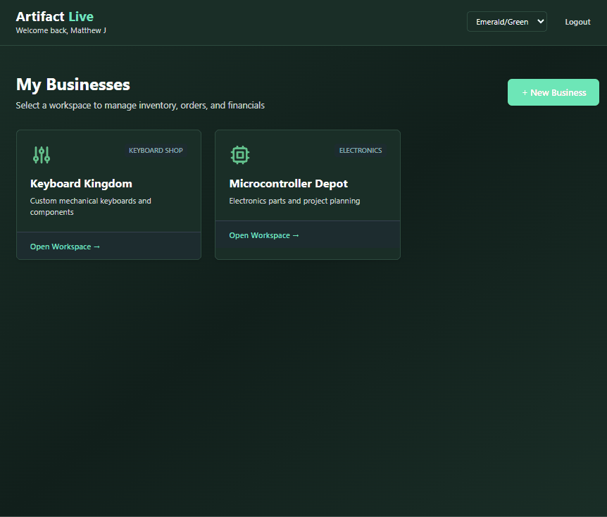

# Artifact Live - Inventory & Operations Management System

[](https://www.python.org/)
[](https://www.mysql.com/)
[](https://reactjs.org/)
[](https://flask.palletsprojects.com/)
[](https://tailwindcss.com/)

> A production-ready inventory management system built on double-entry accounting principles, combining real-world supply chain operations with enterprise-grade financial tracking.

## 📋 Table of Contents

- [About the Project](#about-the-project)
- [Demo](#demo)
- [Core Features](#core-features)
- [Tech Stack](#tech-stack)
- [Getting Started](#getting-started)
  - [Prerequisites](#prerequisites)
  - [Installation](#installation)
  - [Running the Application](#running-the-application)
- [Architecture](#architecture)
- [Database Schema](#database-schema)
- [API Documentation](#api-documentation)
- [Roadmap](#roadmap)
- [Related Projects](#related-projects)
- [Contributing](#contributing)
- [License](#license)
- [Contact](#contact)

## 📖 About the Project

**Artifact Live** is a full-stack inventory management and operations system that brings enterprise-level tracking to small businesses and independent operations. Unlike typical inventory apps that focus solely on quantities, Artifact Live integrates **complete financial accounting** with operational management - tracking not just what you have, but what it's worth and how it impacts profitability.

### Why I Built This

After building [Digital Harvest](https://github.com/matthew-s-jenkins/digital-harvest-sim) to simulate retail operations and generate analytics-ready data, I wanted to apply those same supply chain principles to a real business. As an independent contractor, I needed a system that could:

- Track actual inventory (products, costs, quantities, locations)
- Manage procurement from multiple vendors
- Record sales and calculate profitability in real-time
- Maintain proper accounting records for tax purposes
- Provide analytics for business decisions

Most inventory systems treat accounting as an afterthought - they track quantities but don't properly handle COGS, don't maintain audit trails, and can't tell you whether you're actually profitable. I wanted a system that worked like a real business from day one, with the same double-entry accounting foundation as [Perfect Books](https://github.com/matthew-s-jenkins/perfect-books).

Artifact Live solves this by combining inventory operations with proper financial tracking. Every purchase, sale, and adjustment creates balanced ledger entries. Inventory is valued using FIFO costing. Profitability is calculated automatically. The system maintains an immutable audit trail for compliance.

### What It Does

Artifact Live provides:
- **Product catalog management** - SKUs, descriptions, pricing, and vendor information
- **Inventory tracking** - Real-time quantities with location support
- **Purchase order management** - Create POs, receive inventory, track costs
- **Sales order processing** - Record sales, calculate profit margins, update inventory
- **FIFO cost accounting** - Automated cost layer tracking and COGS calculation
- **Double-entry ledger** - Every transaction maintains accounting integrity
- **Vendor management** - Track suppliers, terms, and purchase history
- **Financial reporting** - P&L, inventory valuation, and profitability analysis

### Technical Highlights

- **Perpetual Inventory System**: Real-time quantity tracking with automatic FIFO costing
- **Double-Entry Accounting**: Every inventory movement creates balanced ledger entries
- **Multi-User Architecture**: Secure authentication with complete data isolation (Perfect Books foundation)
- **Normalized Database**: MySQL schema designed for data integrity and Power BI connectivity
- **Stateless REST API**: Flask API enabling both web interface and future integrations
- **Immutable Audit Trail**: Complete transaction history for compliance and analysis

**Related Projects:**
- [Digital Harvest](https://github.com/matthew-s-jenkins/digital-harvest-sim) - Business simulation that inspired this system's supply chain logic
- [Perfect Books](https://github.com/matthew-s-jenkins/perfect-books) - Personal finance app that provides the accounting foundation

## 🎬 Demo



*Multi-business workspace with inventory tracking, location management, fast ingestion wizard, and complete financial accounting integration.*

## 🔧 Technical Challenges Solved

### 1. FIFO Cost Layer Management

Accurate profitability requires knowing the actual cost of each item sold. I implemented:

- **Layered cost tracking**: Each purchase creates a new cost layer
- **Automatic COGS calculation**: System pulls from oldest layers first (FIFO)
- **Partial layer consumption**: Handle selling quantities that span multiple purchase batches
- **Inventory valuation**: Real-time calculation of remaining inventory value

This matches how real businesses track inventory costs and ensures profit margins are accurate, not estimated.

### 2. Purchase Order to Inventory Flow

Managing the complete procurement cycle required:

- **PO creation and approval workflow**: Draft orders before committing
- **Partial receiving**: Handle shipments that arrive in multiple batches
- **Cost reconciliation**: Update cost layers when actual costs differ from PO estimates
- **Vendor performance tracking**: Lead times, pricing history, and reliability metrics

This creates a complete audit trail from purchase decision to inventory receipt.

### 3. Real-Time Inventory with Multi-Location Support

Tracking inventory across locations while maintaining accuracy:

- **Location-based quantities**: Each product tracked per physical location
- **Transfer management**: Move inventory between locations with proper accounting
- **Stockout prevention**: Low inventory alerts based on location and reorder points
- **Inventory adjustments**: Handle shrinkage, damage, and counts with full audit trail

This supports scaling from single-location operations to multi-warehouse distribution.

### 4. Integrated Financial Ledger

Every operational action creates proper accounting entries:

- **Purchase transactions**: DR Inventory, CR Cash/AP
- **Sales transactions**: DR Cash/AR, CR Revenue + DR COGS, CR Inventory
- **Adjustments**: Proper accounting for damaged goods, shrinkage, returns
- **Financial statements**: Auto-generated P&L and balance sheet from ledger

This ensures the books always balance and profitability is accurate in real-time.

---

## ✨ Core Features

**Inventory Management**
- [x] Product catalog with SKU, description, category, pricing, vendor mapping
- [x] Real-time quantity tracking with FIFO cost layers
- [x] Multi-location support - track inventory across warehouses, stores, bins
- [x] FIFO cost layers for accurate COGS calculation
- [x] Fast ingestion wizard for batch inventory entry
- [x] Location-based inventory breakdown and reporting
- [ ] Reorder points with low inventory alerts
- [ ] Inventory adjustments for shrinkage, damage, physical counts

**Procurement & Vendor Management**
- [ ] Vendor catalog with contact info, payment terms, lead times
- [ ] Purchase order creation and approval workflow
- [ ] Receiving workflow that updates cost layers
- [ ] Partial shipment handling
- [ ] Vendor performance tracking
- [ ] Complete purchase history audit trail

**Sales & Order Management**
- [ ] Sales order processing and customer reservations
- [ ] Inventory allocation before shipment
- [ ] Real-time profit margin calculation using FIFO costs
- [ ] Pick, pack, ship fulfillment workflow
- [ ] Customer management and order history
- [ ] Sales analytics and product performance reporting

**Financial Accounting**
- [x] Double-entry ledger with complete transaction history
- [x] Chart of accounts management (Assets, Liabilities, Equity, Revenue, Expense)
- [x] Real-time accounting equation tracking (Assets = Liabilities + Equity)
- [x] Trial balance with debit/credit totals
- [x] Balance sheet generation
- [x] Ledger view showing transaction impacts on the accounting equation
- [x] Transaction reversal for manual entries
- [x] COGS automation via FIFO cost layers
- [x] Real-time inventory valuation
- [ ] P&L reporting (Income Statement)
- [ ] Accounts payable tracking
- [ ] Accounts receivable management

**Security & Multi-User**
- [x] User authentication with bcrypt + Google OAuth
- [x] Session management via Flask-Login
- [x] Complete data isolation between users
- [x] Multi-business/workspace support
- [x] Immutable audit trail with transaction UUIDs
- [ ] Role-based access control

## 🛠️ Tech Stack

| Component | Technology | Purpose |
|-----------|-----------|---------|
| **Backend** | Python 3.8+ | Business logic and inventory engine |
| **Database** | MySQL 8.0+ | Persistent storage with ACID compliance |
| **API** | Flask + Flask-Login | RESTful API with session authentication |
| **Frontend** | React 18 | Interactive single-page application |
| **Styling** | Tailwind CSS | Modern, responsive UI design |
| **Security** | bcrypt | Password hashing and authentication |
| **Analytics** | Power BI / Tableau | Business intelligence dashboards (planned) |

## 🚀 Getting Started

### Prerequisites

Before running Artifact Live, ensure you have:

- **Python 3.8+** installed ([Download](https://www.python.org/downloads/))
- **MySQL Server 8.0+** running locally or remotely ([Download](https://dev.mysql.com/downloads/))
- A modern web browser (Chrome, Firefox, or Edge recommended)

### Installation

1. **Clone the repository**
   ```bash
   git clone https://github.com/matthew-s-jenkins/artifact-live.git
   cd artifact-live
   ```

2. **Install Python dependencies**
   ```bash
   pip install -r requirements.txt
   ```

3. **Configure environment variables**

   Create a `.env` file in the project root:
   ```env
   DB_HOST=localhost
   DB_PORT=3306
   DB_USER=your_mysql_username
   DB_PASSWORD=your_mysql_password
   DB_NAME=artifact_live
   ```

4. **Initialize the database**

   ⚠️ **Warning**: This will drop and recreate the `artifact_live` database!

   ```bash
   python src/setup.py
   ```

   You should see output confirming table creation.

### Running the Application

1. **Start the API server**
   ```bash
   python src/api.py
   ```
   You should see: `* Running on http://127.0.0.1:5000`

2. **Open the interface**
   - **Simple**: Double-click `index.html` to open directly in your browser
   - **Server** (for better compatibility):
     ```bash
     python -m http.server 8080
     ```
     Then navigate to: `http://localhost:8080/index.html`

3. **Register/Login**
   - First visit: Click "Register" to create an account
   - Subsequent visits: Login with your credentials

## 🏗️ Architecture

### Stateless Design

Artifact Live uses a **stateless engine** architecture borrowed from Perfect Books:
- All state is stored in the MySQL database
- No session state maintained on the server
- Each API call is independent and authenticated
- Scalable and suitable for containerization

### Data Flow

```
┌─────────────┐
│   Browser   │
│  (React UI) │
└─────┬───────┘
      │ HTTPS (with credentials)
      ↓
┌─────────────────┐
│  Flask API      │
│  + Flask-Login  │ ← Session cookies
└────────┬────────┘
         │ Validates user_id on every request
         ↓
┌─────────────────┐
│ Business Engine │ ← Inventory + Accounting logic
└────────┬────────┘
         │
         ↓
┌─────────────────┐
│  MySQL Database │ ← Products, inventory, ledger, orders
└─────────────────┘
```

### Double-Entry Accounting

Every inventory operation creates balanced ledger entries:

**Example: Purchase $500 of inventory**
```
DR: Inventory         $500  (increase asset)
CR: Accounts Payable  $500  (increase liability)
```

**Example: Sell item with $30 cost for $50**
```
DR: Cash              $50   (increase asset)
CR: Revenue           $50   (increase revenue)

DR: COGS              $30   (increase expense)
CR: Inventory         $30   (decrease asset)
```

## 💾 Database Schema

The database follows **normalized design principles** with referential integrity:

### Core Tables

| Table | Purpose | Key Columns |
|-------|---------|-------------|
| `users` | Authentication | user_id, username, password_hash |
| `products` | Product catalog | product_id, sku, name, category, default_price |
| `vendors` | Supplier information | vendor_id, name, contact_info, payment_terms |
| `inventory` | Current quantities | inventory_id, product_id, location_id, quantity |
| `cost_layers` | FIFO cost tracking | layer_id, product_id, quantity_remaining, unit_cost |
| `purchase_orders` | Procurement | po_id, vendor_id, status, total_cost |
| `sales_orders` | Customer orders | order_id, customer_id, status, total_revenue |
| `financial_ledger` | **Double-entry ledger** | entry_id, transaction_uuid, account, debit, credit |

### Key Design Decisions

- **Foreign Keys**: Enforce referential integrity between tables
- **Cascade Deletes**: Deleting a user removes all their data automatically
- **Indexes**: Optimized for common queries (user_id, product_id, transaction_date)
- **Decimal Precision**: All money values use `DECIMAL(12,2)`
- **Immutable Ledger**: Financial ledger is append-only for audit trail
- **Transaction UUIDs**: Group related ledger entries for reversal and tracking
- **Cost Layer System**: Separate table tracks FIFO inventory costs

---

## 📡 API Documentation

### Authentication Endpoints

| Method | Endpoint | Description |
|--------|----------|-------------|
| POST | `/api/register` | Register new user |
| POST | `/api/login` | Login with credentials |
| POST | `/api/logout` | End session |
| GET | `/api/check_auth` | Verify authentication |

### Product Endpoints

| Method | Endpoint | Auth | Description |
|--------|----------|------|-------------|
| GET | `/api/products` | ✓ | Get all products |
| POST | `/api/products` | ✓ | Create new product |
| PUT | `/api/products/<id>` | ✓ | Update product |
| DELETE | `/api/products/<id>` | ✓ | Delete product |

### Inventory Endpoints

| Method | Endpoint | Auth | Description |
|--------|----------|------|-------------|
| GET | `/api/inventory` | ✓ | Get inventory levels |
| GET | `/api/inventory/<product_id>` | ✓ | Get product inventory details |
| POST | `/api/inventory/adjust` | ✓ | Record inventory adjustment |
| POST | `/api/inventory/transfer` | ✓ | Transfer between locations |

### Purchase Order Endpoints

| Method | Endpoint | Auth | Description |
|--------|----------|------|-------------|
| GET | `/api/purchase_orders` | ✓ | Get all POs |
| POST | `/api/purchase_orders` | ✓ | Create new PO |
| PUT | `/api/purchase_orders/<id>` | ✓ | Update PO |
| POST | `/api/purchase_orders/<id>/receive` | ✓ | Receive inventory from PO |

### Sales Order Endpoints

| Method | Endpoint | Auth | Description |
|--------|----------|------|-------------|
| GET | `/api/sales_orders` | ✓ | Get all sales orders |
| POST | `/api/sales_orders` | ✓ | Create new sales order |
| PUT | `/api/sales_orders/<id>` | ✓ | Update sales order |
| POST | `/api/sales_orders/<id>/fulfill` | ✓ | Fulfill and ship order |

### Financial Endpoints

| Method | Endpoint | Auth | Description |
|--------|----------|------|-------------|
| GET | `/api/ledger` | ✓ | Get transaction history |
| GET | `/api/financials/pl` | ✓ | Get P&L statement |
| GET | `/api/financials/inventory_value` | ✓ | Get inventory valuation |

## 🗺️ Roadmap

### Current Status (v1.0 - MVP)

**Phase 1: Foundation** ✅
- [x] Database schema and setup
- [x] User authentication (bcrypt + Google OAuth)
- [x] Product catalog
- [x] Basic inventory tracking
- [x] Theme system (6 color options)
- [x] Multi-business/workspace support

**Phase 2: Core Operations** (In Progress)
- [x] Business dashboard with Inventory, Locations, Ingestion, and Financials tabs
- [x] Location management system
- [x] Multi-location inventory tracking
- [x] Fast ingestion wizard with batch entry
- [x] FIFO cost layer tracking
- [x] Chart of accounts (all 5 account types)
- [x] Double-entry ledger integration
- [x] Accounting equation display
- [x] Trial balance
- [x] Balance sheet
- [x] Ledger view with transaction-by-transaction equation impacts
- [x] Transaction reversal (manual entries only)
- [ ] Purchase order creation and management
- [ ] Sales order processing
- [ ] Kitting/assembly system (BOM)
  - [ ] Parent-child product relationships
  - [ ] Component consumption tracking
  - [ ] Keyboard-specific features (keycap compatibility, layout validation)
  - [ ] Assembly cost rollup
  - [ ] Inventory depletion on kit sales

**Phase 3: Financial Integration** (Partial)
- [x] COGS automation via FIFO
- [x] Real-time inventory valuation
- [x] Basic financial reporting (Ledger, Trial Balance, Balance Sheet)
- [ ] P&L reporting
- [ ] Vendor management
- [ ] Analytics dashboard

### Planned Features (v2.0+)

- [ ] Power BI dashboard integration
- [ ] Barcode scanning via mobile app
- [ ] Automated reorder points
- [ ] Advanced reporting (turnover, vendor performance, profitability)
- [ ] Multi-currency support
- [ ] Serialized inventory tracking
- [ ] Returns management (customer + vendor RMAs)
- [ ] Shipping API integration (UPS, FedEx, USPS)
- [ ] Customer portal
- [ ] Marketplace integrations (Amazon, eBay, Shopify)
- [ ] Demand forecasting
- [ ] WMS features
- [ ] EDI integration
- [ ] Multi-warehouse optimization

## 🔗 Related Projects

### Digital Harvest - Business Simulation Engine

Artifact Live applies the supply chain concepts from [Digital Harvest](https://github.com/matthew-s-jenkins/digital-harvest-sim) to real business operations.

**Shared Principles:**
- Perpetual inventory system with FIFO costing
- Double-entry accounting (Assets = Liabilities + Equity)
- Vendor management and procurement workflows
- BI-ready normalized database schema
- Flask REST API architecture

**Key Differences:**
| Artifact Live | Digital Harvest |
|--------------|-----------------|
| Real inventory tracking | Simulated inventory |
| Actual purchase/sales orders | Generated transactions |
| Multi-user production system | Single-user simulation |
| Business operations focus | Analytics and learning focus |

### Perfect Books - Personal Finance Management

Artifact Live uses the authentication and accounting foundation from [Perfect Books](https://github.com/matthew-s-jenkins/perfect-books).

**Shared Architecture:**
- Multi-user authentication with data isolation
- Double-entry ledger system
- Immutable audit trail with transaction UUIDs
- Flask + React + MySQL stack
- Stateless API design

## 🤝 Contributing

Contributions are welcome! This project is ideal for:
- **Students** learning about inventory management, accounting, or full-stack development
- **Developers** interested in supply chain applications
- **Business owners** who want to contribute features

### How to Contribute

1. Fork the repository
2. Create a feature branch (`git checkout -b feature/AmazingFeature`)
3. Commit your changes (`git commit -m 'Add some AmazingFeature'`)
4. Push to the branch (`git push origin feature/AmazingFeature`)
5. Open a Pull Request

## 📄 License

This project is open source and available under the [MIT License](LICENSE).

## 📧 Contact

**Matthew Jenkins**
- GitHub: [@matthew-s-jenkins](https://github.com/matthew-s-jenkins)
- LinkedIn: [linkedin.com/in/matthew-s-jenkins](https://www.linkedin.com/in/matthew-s-jenkins/)
- Email: [mjenkins87@live.com](mailto:mjenkins87@live.com)

## 🙏 Acknowledgments

- MySQL for robust relational database management
- Flask for lightweight, powerful API development
- React and Tailwind CSS for modern UI development
- Digital Harvest and Perfect Books for architectural inspiration

---

**Built with Python**
